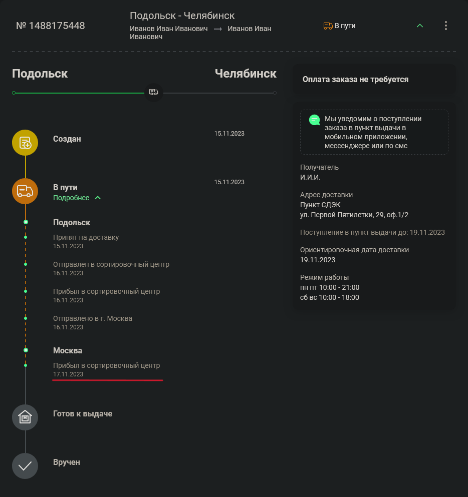
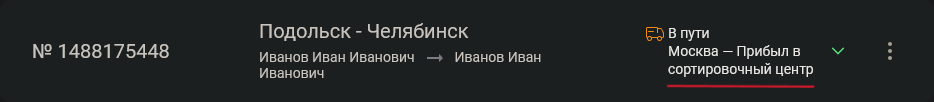

# CDEK tracking status

Tampermonkey-скрипт для удобного отображаения последнего статуса заказа в СДЭК

## Суть

По-умолчанию, чтобы увидеть последний статус заказа, нужно раскрыть подробную информацию, раскрыть статусы и найти
последний статус. Какой-то UI в ущерб UX.

Поэтому я набросал скрипт, который по нажатию на `Alt`+`Q` подгрузит и отобразит последний статус для всех заказов:

